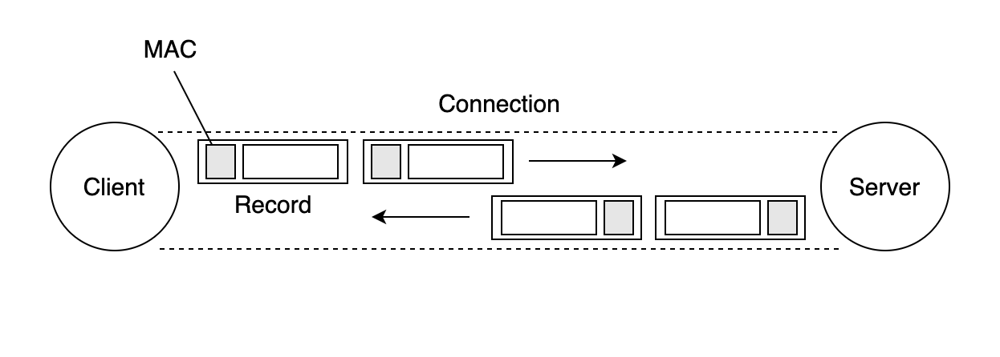

# 架构

本文介绍thttps的高级架构。它可以帮助您熟悉代码库。

thttps 启用客户端和服务器建立 TCP 连接。因此，每个连接都使用MAC将称为“记录”的加密数据块发送给其他连接，以检查数据完整性。

## 代码

本节简要介绍文件和数据结构的各种作用。

- **`pkg/tls/handshake_cllient`, `pkg/tls/handshake_server` :** 

  如果您对TLS握手的工作原理感兴趣，那么这里就是您的最佳选择。这两个文件显示了客户端和服务器在相互传输数据之前如何握手。

  `Conn` 发挥主要作用，如发送、接收握手消息。 `Conn` uses `halfConn` 用于加密、解密消息和 MAC 验证。

- **`pkg/tls/conn`:**

 `Conn` , `halfConn` 可以定义数据结构，并对其内部逻辑进行加密、解密。

- **`pkg/tls/handshake_messages`:**

  您可以找到整个握手消息结构，例如 ClientHello、ServerHello 及其序列化、反序列化逻辑

